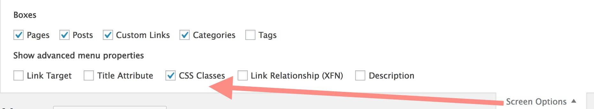

# HTML5up Eventually Theme for Wordpress

-----
*If this kind of stuff has any value, please consider supporting me so I can do more!*

 

----- 

A configurable Wordpress Theme version of [HTML5up Eventually Theme](https://html5up.net/eventually) made for the internet by [@cogdog](http://cog.dog). It creates a simple, elegant calling card site, something that looks like

where the background has a subtle sliding slide show of images. While this feature is hardcoded into the HTML5up theme's javascript files, in the WordPress version images are drawn from the pool of uploaded images.

With the use of the optional [FontAwesome For Menus 5 plugin](http://github.com/cogdog/font-awesome-5-menus) (also by me), you can create a menu of social media links in the footer.

The front page content is drawn from the latest post. The basic version would be just to use one post to power the site. But it is also set up so you might have a series of posts that you want to make available as page through clicks (via arrow navigation links). These can be configured in the Customizer.

## Examples In Action

* Demo Site https://lab.cogdogblog.com/eventually/
* WordPress Calling Card Themes https://cards.cog.dog/

## Installing from Scratch

Install this theme on any self hosted Wordpress site. You cannot do this on Wordpress.com, get a real web hosting package.

You can download a ZIP file of this theme via the green **Code*" button above (the Download Zip option) or directly `wp-eventually-master.zip`. 

The zip can be uploaded directly to your site via **Themes** in the Wordpress dashboard, then **Add Theme** and finally **Upload Theme**. If you run into size upload limits or just prefer going old school like me, unzip the package and ftp the entire folder into your `wp-content/themes` directory.

## Updating the Theme

As of WordPress version 5.5 themes uploaded as .ZIP files can now be updated the same way you installed it; just download the newest version, and update it  via **Themes** in the Wordpress dashboard, then **Add Theme** and finally **Upload Theme**. You will be asked to confirm updating the theme with the newer version.  

If you have ftp/sftp access to your site (or this can be done in a cpanel file manager), simply upload the new theme files to the `wp-content/themes` directory that includes the older version theme. 

For those that lack direct file upload access or maybe that idea sends shivers down the spine, upload and activate the [Easy Theme and Plugin Upgrades](https://wordpress.org/plugins/easy-theme-and-plugin-upgrades/) plugin -- this will allow you to upload a newer version of a theme as a ZIP archive, the same way you add a theme by uploading.

## Customizing with the Customizer

Use the WordPress Customizer to manage your site. Look for the `Customize` item in the black admin menu or in the dashboard access it via `Appearance` -> `Customize`

Below are the ways this theme uses the Customizer

### Set the Background Images

The main feature of this theme are the sliding images that appear behind the content. These are managed under `Backgrund Slider Images`. The theme comes with a default set of four images (all are public domain images from my flickr site) that will be seen when the theme is installed.

Click **Add New Image** to upload each one you want to use in your own site. Use big images, the theme will crop them to be 1920 × 900 pixels. There is no limit to how many images you can use.

### Set More Theme Options

Open the panel for `Eventually Mods` to manage the following settings.

**Navigation Mode** defines where the content comes from. The default option is to use the content of the most recent post. This can be a simple one screen site, or maybe just the latest info you publish as a post. The other option produces navigation links if you want viewers to step through a series of posts. And a third mode makes it so each load inserts a random post (e.g. maybe for a site that is a collection of quotes?)

**Background Opacity** lets you manage the visibility of the background images, higher values make them brighter

**Footer Text** provides your own text in the first section of the footer

**Social Media Size** If you have activated the Font Awesome 4 Menus plugin and defined a menu, use this slider to control the size of the icons.

### Social Media Icons

To have a customized set of icon links on the front of the site, download, install and activate the [Font Awesome 5 Menus](https://github.com/cogdog/font-awesome-5-menus) plugin. This allows you to add an icon to any menu item.

From the Wordpress Dashboard look under **Appearances** for **Menus**. Click **create a new menu**  name it whatever you like -- `social` is  a good choice. Under  **Menu Settings** next to **Display Location** check the box for `Social Media`. 

To add a social media (or any link), open the panel for **Custom Link**. 

Enter a title for the site and provide the URL that points to your content on that site. Add as many as you like. You can drag and drop them to change the order.

To set the icon, you must first enable the visibility of CSS classes for each menu item.  Click **Screen Options** in the upper right, and check the box for **CSS Classes**.

Open an item in your Social Menu and you will now see a field for entering CSS Class names. You have the choice to add from [well over 1400 icons in the Font Awesome free collection](https://fontawesome.com/icons?d=gallery&m=free). Find the name of the icon you wish to use, and enter it's all of it's class names as listed,

For example these are the class names to render the icon for typical social media sites (these should be all lower case):

* fab fa-twitter
* fab fa-facebook
* fab fa-youtube
* fab fa-linkedin
* fab fa-instagram
* fab fa-flickr

With the Font Awesome icons, you can add any site you wish to be represented on the front page and pick the icon you prefer.

**Save** your menu and check out the spiffy icons up front. 

## Suggested Plugins

* [Font Awesome 5 Menus](https://github.com/cogdog/font-awesome-5-menus) used to add the icons to the social media links below the tag line
* [Easy Theme and Plugin Upgrades](https://wordpress.org/plugins/easy-theme-and-plugin-upgrades/) allows you to update the theme by uploading the zip file again as a new server (because wordpress does not provide this capability)

## Features / History

* v0.1 First release, yup it works
* v0.2 Added to customizer options for navigation mode and slider settings for social media icon size
* v0.3 Added to customizer slider settings for background opacity

### Requests

* *You tell me* Fork and edit to suggest features or [toss them into the Issues bin](https://github.com/cogdog/wp-eventually/issues)

 